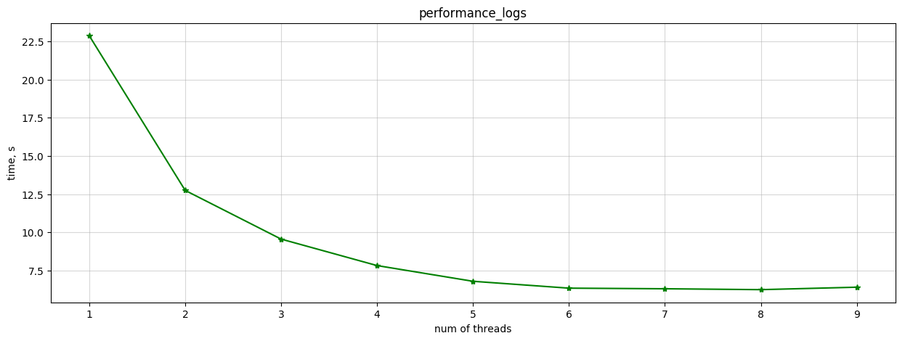

# 🌳 Random Forest 
Parallel implementation of random forest algorithm. Currently working with binary features only.

## Evaluation
Implemented algorithm was compared with sklearn version. 
To validate models the dataset was generated. 
It consists of 4 classes with 50 binary features generated with different distribution parameters.
Accuracy metric was used to calculate scores.
The achieved results represented in the table below

model | n_estimators | train score | validation score
-|-|-|-
Custom RandomForest | 20 | 0.994 | 0.740
RandomForestClassifier (sklearn) | 10 | 0.987 | 0.712
RandomForestClassifier (sklearn) | 20 | 0.995 |  0.735
DecisionTreeClassifier (sklearn) | - | 0.995 | 0.665
XGBClassifier | 100 | 0.897 |  0.795

## Performance
RandomForest (n_estimators = 100 and max_depth = 100) 
was built several times with different amounts of threads 
to assess how such parallelization could speed up computations.

